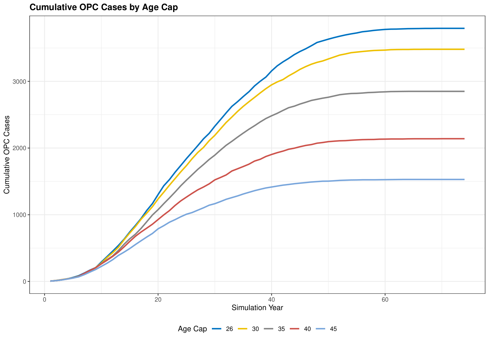
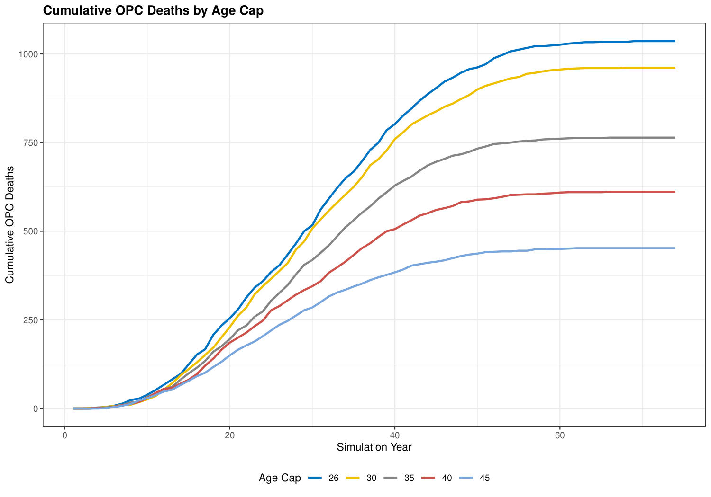
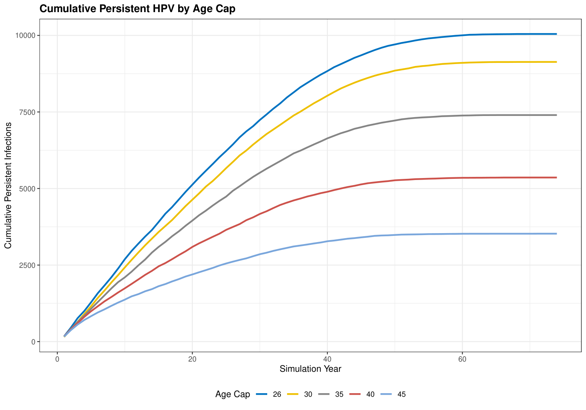

## Model overview

:::: {.columns}
::: {.column width="48%"}

**Cohort**

- 1.5M male veterans, ages 26--45 at entry
- Male only (VHA OPC burden is overwhelmingly male)
- 75-year horizon, annual timesteps
- 3% discount rate (costs and QALYs)
- Common random numbers across scenarios

**5 health states**

Healthy $\to$ Infected $\to$ Persistent $\to$ Cancer $\to$ Dead

with background mortality from all states (SSA 2021 male life table)

**Agent attributes**: age, smoker, heavy alcohol use, vaccination status, health state, infection and cancer duration

:::
::: {.column width="48%"}

**5 scenarios** — vaccination age cap

| Scenario | Age cap |
|---|---|
| Status quo | 26 |
| Expansion 1 | 30 |
| Expansion 2 | 35 |
| Expansion 3 | 40 |
| Expansion 4 | 45 (FDA-approved) |

  

**Outcome measures**: cumulative OPC cases, cumulative OPC deaths, cumulative persistent HPV infections

:::
::::

## State transitions

| Transition | Mechanism | Parameters |
|---|---|---|
| Healthy $\to$ Infected | Annual probability | $p = 0.041$/yr; reduced 90% if vaccinated; increased by alcohol (RR 1.43), smoking (RR 1.15) |
| Infected $\to$ Healthy | Annual clearance | 0.60 (yr 0--1), 0.40 (yr 2+); reduced by smoking (RR 0.70) |
| Infected $\to$ Persistent | One-shot roll at $\geq$2 yr | $p = \mathbf{0.020}$ *(calibrated)*; reduced 85% if vaccinated |
| Persistent $\to$ Cancer | Weibull latency | shape $= 3$, scale $= 20$ (mean $\approx 18$ yr); accelerated by smoking/alcohol |
| Cancer $\to$ Dead (OPC) | Competing risks | $p_{\text{OPC}} = \frac{\text{excess rate}}{\text{background} + \text{excess}}$; $\approx 28\%$ attributed to OPC |
| Any $\to$ Dead (background) | Age-specific | SSA 2021 male life table; $\times 2.0$ if current smoker |

::: {style="font-size: 0.8em;"}
Persistence: one-shot roll per infection episode at $\geq 2$ years continuous infection. Agent flagged so no annual re-rolling.
:::

## Key parameters

::: {style="font-size: 0.8em;"}

| Parameter | Value | Source |
|---|---|---|
| Annual HPV acquisition | 0.041/yr | Dube Mandishora 2024 (HIM Study US, $n=834$) |
| Clearance probability | 0.60 (yr 0--1) / 0.40 (yr 2+) | Kreimer 2013 (HIM cohort) |
| **Persistence probability** | **0.020 (calibrated)** | **Target: 6--9/100k PY (Saxena 2022 VA); achieved 6.59/100k PY** |
| OPC latency (Weibull) | shape $= 3$, scale $= 20$, mean $\approx 18$ yr | Consistent with reviewer: "likely 10--30 years" |
| OPC 5-year survival | $\approx 79\%$ | Ang 2010 (HPV+ OPC, $n=323$) |
| Vaccine efficacy — acquisition | 90% reduction | Damgacioglu 2022; Chaturvedi 2018 |
| Vaccine efficacy — persistence | 85% reduction | Extrapolated (no direct trial data) |
| Vaccine uptake | 15%/yr if eligible | **Placeholder** — Aim 1 will supply age-stratified rates |
| Background mortality | SSA 2021 male life table | SSA Trustees Report 2024 |

:::

## Progress since grant review

:::: {.columns}
::: {.column width="50%"}

**Addressed**

::: {style="font-size: 0.9em;"}

- **Sample size**: 10k $\to$ 1.5M (policy-relevant VHA population)

- **VA OPC incidence calibration**: $p_\text{pers} = 0.020$ yields 6.59/100k PY; target 6--9 (Saxena 2022)

- **OPC latency**: Weibull mean $\approx 18$ yr (scale $= 20$), consistent with reviewer range of 10--30 yr

- **OPC death attribution**: competing risks approach ($\approx 28\%$ CFR); flat assignment previously gave 99.6%.

:::
:::

::: {.column width="50%"}

**Remaining**

::: {style="font-size: 0.9em;"}

- **Cost-effectiveness analysis**: vaccine cost (\$550/series, CDC 2024), OPC treatment cost (Saxena 2022 VA), and ICER computation not yet added to slides

- Vaccination uptake: flat 15\% placeholder $\to$ replace with Aim 1 real data (age-stratified by 5-year band)

- Probabilistic sensitivity analysis (PSA) and tornado diagram not yet run

- Veteran mortality multiplier $= 1.0$ (general US male); literature suggests $\sim 1.1$--$1.2$ for VA

- No VE discount for ages 40--45 (immunogenicity non-inferior by trial, but real-world effectiveness uncertain)

- MSM removed from model (was in original design; out of current scope)

:::
:::
::::

## Results: cumulative OPC cases

{width=70%}

::: {style="font-size: 0.8em; margin-top: 10px;"}
$n = 1{,}500{,}000$ male veterans; CRN; calibrated model ($p_{\text{pers}} = 0.020$, 6.59 HPV+ OPC per 100k PY). Age cap 26 = status quo.
:::

## Results: cumulative OPC deaths

{width=70%}

::: {style="font-size: 0.8em; margin-top: 10px;"}
Competing-risks attribution ($\approx 28\%$ CFR); higher age caps reduce cumulative OPC-attributed deaths monotonically.
:::

## Results: cumulative persistent HPV infections

{width=70%}

::: {style="font-size: 0.8em; margin-top: 10px;"}
Intermediate endpoint. Monotonic reduction with higher age cap; magnitude reflects additional infections averted by extending vaccine eligibility.
:::
